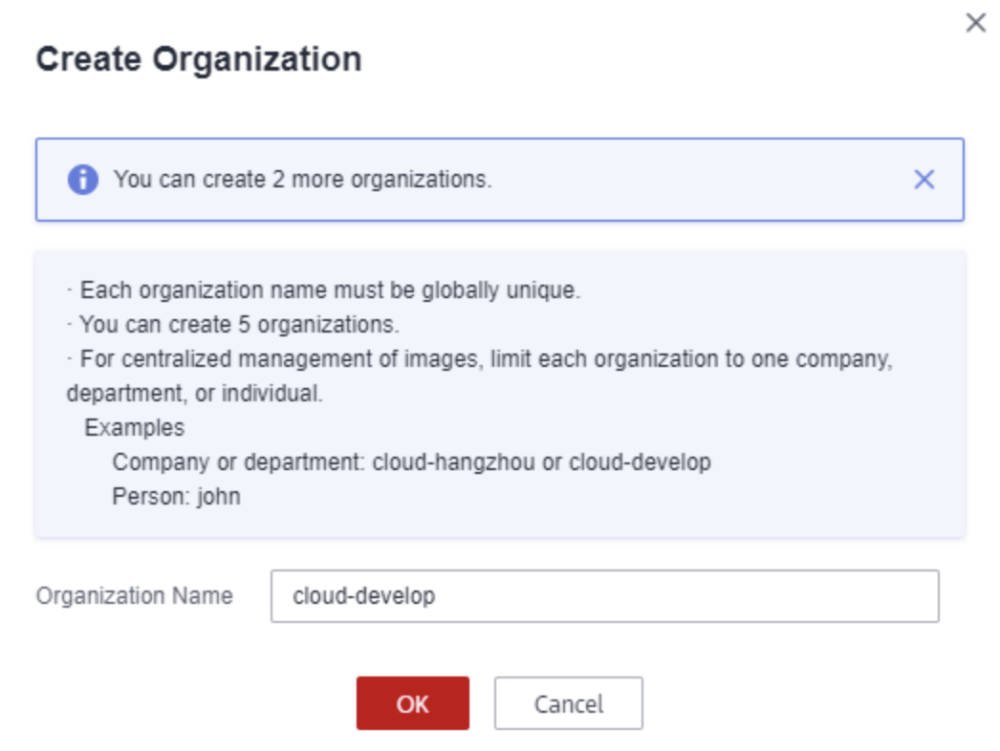
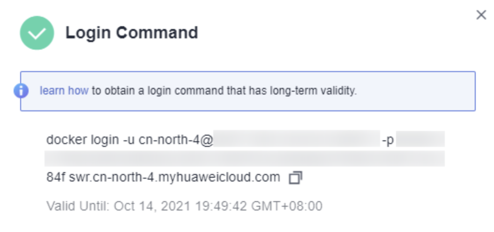

# Python CCE
Este projeto serve como tutorial para enviar imagens do docker para o SWR (Software Repository), para utilizá-las no CCE (Cloud Container Engine) e conectar os containers ao RDS (Relational Database System).

## 1. Enviar Imagens ao SWR (Software Repository)
1. Primeiramente, em sua máquina, instale o Docker:
    ```
    curl -fsSL get.docker.com -o get-docker.sh
    sh get-docker.sh
    sudo systemctl daemon-reload
    sudo systemctl restart docker
    ```

2. Clone o repositório e faça o build da imagem deste projeto:
    ```
    git clone https://github.com/MatheusFarias03/PythonGaussDB.git
    docker build -t python_gaussdb .
    ```

3. Crie uma organização no console do SWR. Uma organização é utilizada para isolar imagens e conceder diferentes permissões de acesso, como: leitura, edição e gestão, a diferentes utilizadores numa conta.
    
    3.1. Acesse o SWR
    
    3.2. No painel de navegação à esquerda, escolha __Organization Management__. Na página exibida, clique em __Create Organization__ no canto superior direito.

    3.3 Insira o nome da organização e clique em __OK__.

    

4. Para conectar-se com o SWR, em sua página de navegação, selecione __Dashboard__ e clique em __Generate Login Command__ no canto superior direito. Copie o comando de login.

    

    Rode o comando de login na máquina em que o docker está instalado. A mensagem __Login Succeeded__ será mostrada após efetivado o acesso.

5. Para fazer o upload da imagem para o SWR, precisamos colocar uma tag específica para imagem, que deve seguir a seguinte estrutura:
    ```
    docker tag [nome_imagem_1:tag_1] [endereço_repositório]/[nome_organização]/[nome_imagem_2:tag_2]
    ```
    * [nome_imagem_1:tag_1] é o nome e a tag da imagem criada em sua máquina.
    * [endereço_repositório] é o endereço do SWR. Ele pode ser encontrado no final do comando de login do SWR, no quarto item dessa seção. 
    * [nome_organização] é o nome da organização criada no SWR.
    * [nome_imagem_2:tag_2] é o nome e a tag da imagem a ser armazenada no SWR.

    Faça o push da imagem para o SWR:
    ```
    docker push [endereço_repositório]/[nome_organização]/[nome_imagem_2:tag_2]
    ```

## 2. Criar um RDS PostgreSQL

